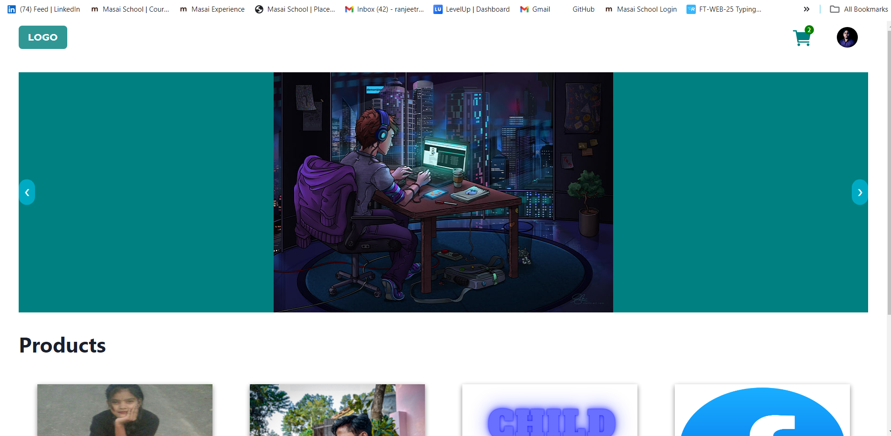

# Arba-Development-Studio

### Site URL :- https://arba-development-studio.netlify.app/

## Backend usage and Instuction visite the url

### Backend URL :- https://arba-development-studio.onrender.com

This is a web application built with React, Redux, Chakra UI, and powered by a node.js , express.js , mongodb multer , cloudnary backend.

## Table of Contents

- [Introduction](#introduction)
- [Features](#features)
- [Installation](#installation)
- [Usage](#usage)
- [Technologies Used](#technologies-used)

## Introduction

The web application is a modern platform for performing all types of crud operations on product. It provides a user-friendly interface, a wide range of functionalities, and a secure authentication system.User can browse items, add them to their cart, and also edit them.

## Features

- User authentication with Node.js and Express.
- create wide range of product and category.
- Add and remove items from the cart.
- Responsive design for mobile and desktop.

## Installation

To run this application locally, follow these steps:

1. Clone this repository to your local machine:
   git clone `https://github.com/yourusername/Arba-Development-Studio.git`
2. Change to the project directory:`cd Arba-Development-Studio` :`cd frontend`
3. Install the required dependencies for the frontend:npm install
4. Install the required dependencies for the backend
   `cd backend`
   `npm install`
5. Create .env in backend file and manage -` mongoURL = ""`
   - `jwtSecret = ""`
   - `JWT_SECRET = ""`
   - `CLOUDINARY_CLOUD_NAME =`
   - `CLOUDINARY_API_KEY =`
   - `CLOUDINARY_API_SECRET =`

## Usage

Create an account or log in to your existing account.
Browse the collection of project or goto my store by clicking on profile on top-right.
Add items to your cart.
Click on the cart icon to view and manage your cart.

### Login page

.png>)

### Product Page

.png>)

### Cart

You can add and remove items from your cart. The cart provides a summary of your selected items.

.png>)

### My Store

The my store give add edit and delete functionalities for each item you have added into your store. You can also see all the projects that are available for.
.png>)

### My Profile

The profile page allows you to edit your information, change password.
.png>)

## Technologies Used

- Frontend:

  - React for building user interfaces
  - Redux for state management
  - Chakra UI for styling
  - Fetch API for making HTTP requests

- Backend:
  - Node.js
  - Express.js
  - MongoDb database with mongoose ODM
  - Bcrypt library for hashing passwords
  - JWT for authentication
  - Multer middleware for handling multipart/form-data
